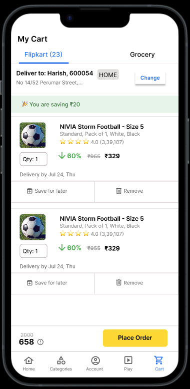

# 🛒 Flipkart-Style Checkout Flow UI (UI/UX Internship Final Project)

This project is a Figma-based redesign and prototype of Flipkart's multi-step mobile checkout process. It includes high-fidelity UI screens and interactions from cart to payment for a smooth user experience.

## 📽️ Project Walkthrough Video

Watch the complete UI explanation on Google Drive:  
👉 [View Video on Drive](https://drive.google.com/file/d/1dIxjiHYHNxd0acSKxo0C83_il7nOMrjw/view?usp=sharing)

## 📱 Screens Designed

- ✅ **Cart Page**
- ✅ **Order Summary Page**
- ✅ **Payment Page**

Each screen follows real-world e-commerce UX principles, is mobile-optimized (390×844 px), and built using Auto Layout in Figma for responsive behavior.

## 🧩 Key Features

- 🔄 Auto Layouts for flexibility and scalability
- 🎨 Consistent colors, fonts (Inter), spacing, and iconography
- 💳 Functional-looking payment options with offer tags
- 🛍️ Detailed product cards with ratings, price breakdown, and strike-through discounts
- 📦 Order progress tracker with delivery address and donation component

## 🔧 Tools Used

- Figma (UI design & prototyping)
- Material Symbols & Iconify (for icons)
- OBS Studio (for screen recording)

## 🌈 Design Highlights

| Element            | Specs                              |
|--------------------|-------------------------------------|
| Frame Size         | 390 × 844 (iPhone 14 Pro resolution)|
| Font               | Inter                               |
| Primary Colors     | #2874F0 (Flipkart Blue), #FFD814 (CTA Yellow), #4CAF50 (Success Green) |
| Icon Source        | Material Symbols / Iconify          |
| Button Size        | 150–180px width × 44–48px height    |
| Corner Radius      | 6–8px                               |
| Shadow/Depth       | Subtle shadows on card & dialogs    |

## 🧪 Prototype Link (Optional)

If you wish to view the live prototype, you can open it here:  
👉 [Figma Prototype](https://www.figma.com/proto/EuTraFQ0tWLQHMlQAudxES/Untitled?node-id=15-257&t=tMtqWowBLxBFfNnz-1&scaling=scale-down&content-scaling=fixed&page-id=0%3A1&starting-point-node-id=1%3A2)

## 📁 Preview

---

## ✨ Conclusion

This project demonstrates a practical understanding of mobile UI/UX principles and real-world e-commerce interface design. The focus was on clean layout, accessibility, usability, and visual consistency — crucial aspects of frontend and product design.

**Author
Harish Aabitheen J
